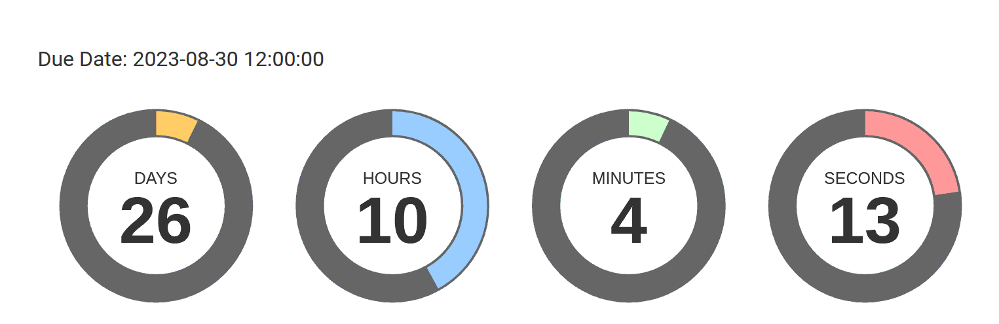

# Down Counter Plugin

The **Down Counter** Plugin is an extension for [Grav CMS](https://github.com/getgrav/grav). It creates a nice circular down counter on any Page by using a Shortcode.

## Demo
[https://hoernerfranzracing.de/werner/en/demo/downcounter](https://hoernerfranzracing.de/werner/en/demo/downcounter)

## Installation

Installing the Down Counter plugin can be done in one of three ways: The GPM (Grav Package Manager) installation method lets you quickly install the plugin with a simple terminal command, the manual method lets you do so via a zip file, and the admin method lets you do so via the Admin Plugin.

### GPM Installation (Preferred, but currently NOT available !)

To install the plugin via the [GPM](https://learn.getgrav.org/cli-console/grav-cli-gpm), through your system's terminal (also called the command line), navigate to the root of your Grav-installation, and enter:

    bin/gpm install downcounter

This will install the Down Counter plugin into your `/user/plugins`-directory within Grav. Its files can be found under `/your/site/grav/user/plugins/downcounter`.

### Manual Installation

To install the plugin manually, download the zip-version of this repository and unzip it under `/your/site/grav/user/plugins`. Then rename the folder to `downcounter`. You can find these files on [GitHub](https://github.com/wernerjoss/grav-plugin-downcounter) or via [GetGrav.org](https://getgrav.org/downloads/plugins).

You should now have all the plugin files under

    /your/site/grav/user/plugins/downcounter

> NOTE: This plugin is a modular component for Grav which may require other plugins to operate, please see its [blueprints.yaml-file on GitHub](https://github.com/wernerjoss/grav-plugin-downcounter/blob/main/blueprints.yaml).

### Admin Plugin

If you use the Admin Plugin, you can install the plugin directly by browsing the `Plugins`-menu and clicking on the `Add` button (currently NOT available, see GPM Installation above).

## Configuration

Before configuring this plugin, you should copy the `user/plugins/downcounter/downcounter.yaml` to `user/config/plugins/downcounter.yaml` and only edit that copy.

Here is the default configuration and an explanation of available options:

```yaml
enabled: true
```

Note that if you use the Admin Plugin, a file with your configuration named downcounter.yaml will be saved in the `user/config/plugins/`-folder once the configuration is saved in the Admin.

## Usage

You can add a nice Down Counter to any Page in your Grav Site by just adding a shortcode somewhere in your Page's .md File,
e.g. ```[downcounter due_date="2023-08-30 12:00:00"][/downcounter]``` where the due_date is the date/time until the Countdown proceeds (when due_date is reached, the Counter stops).  
It will look like this:   
Note that ATM, the Format of the due_date Parameter must be 'YYYY-MM-DD hh:mm:ss' - maybe there will be other formatting Options (depending on Language Setting) in the future.

## Credits

This Plugin uses [TimeCircles](https://github.com/wimbarelds/TimeCircles) for Display/Animation of the Counter.

## To Do

- [ ] Localisation

